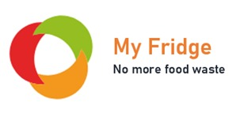
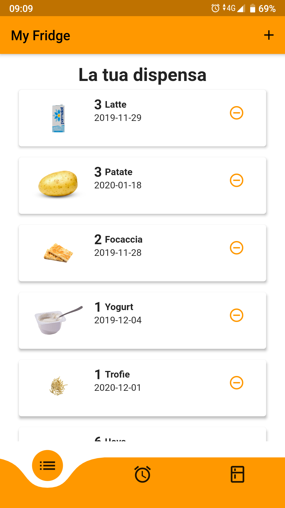
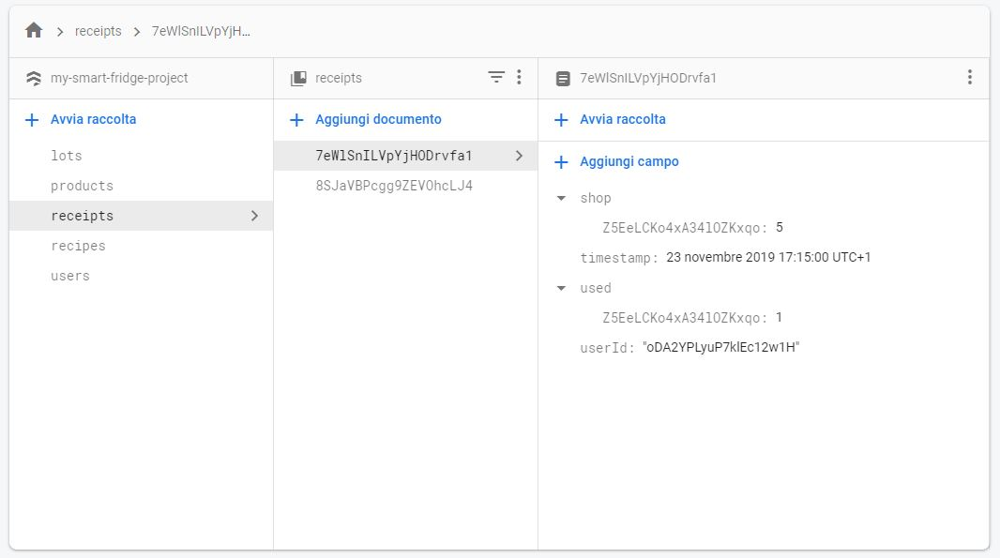

# My Fridge app

An application built in 12 hours during [SVST Hackathon #1 @liguria](https://svst-liguria.it/hackathon/)

## What this project do:

This project is an application that helps you better manage food in your fridge by eliminating food waste.

This application is made with Flutter framework an use Google Firebase database to store all your data.

## Database
This app work in pair with Google Firebase. If you want to try it you must open a new Firebase project and add your database configuration inside the app project. Then you need to add some data in the database.

